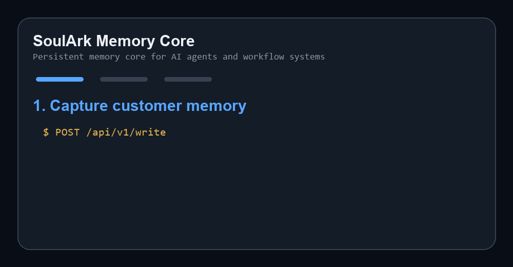
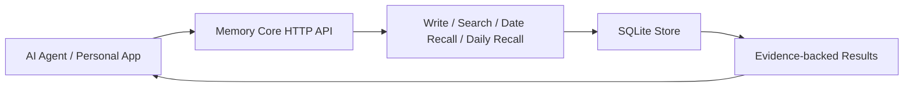

# SoulArk Memory Core

Persistent memory core for AI agents and workflow systems.

Built for:

- AI agents
- workflow automation
- MCP ecosystem
- long-term memory
- structured recall

> Open-source long-term memory core for AI Agents: stop making your AI start from zero every time.

[中文说明](README.zh-CN.md)

SoulArk Memory Core is a self-hostable long-term memory foundation for AI agents, personal AI assistants, and digital twin products. It focuses on durable memory records, traceable evidence, deletion, export, and a small HTTP API that can sit behind your own agent layer.



## Why SoulArk Memory Core?

Most AI assistants are stateless: every new session feels like a fresh introduction. SoulArk Memory Core gives your agent a minimal memory API so it can write, keyword-search, recall by date, inspect, delete, and export memory with evidence.

It is designed for:

- long-term memory for AI agents
- self-hosted personal AI assistants
- model-agnostic memory infrastructure
- digital twin and second-brain products
- applications that need traceable evidence instead of opaque recall

SoulArk Memory Core does not promise perfect or permanent truth. Memory can become outdated or corrected over time. v0.1 focuses on evidence, traceability, deletion, and export; correction, replacement, and stale-memory lifecycle features are roadmap items.

## Architecture



## Use Case: Company Sales Assistant

A company sales assistant can turn scattered customer interactions into durable, searchable memory for the next workflow step.

Example workflow:

- A sales rep records: `ACME prefers short renewal proposals and cares most about onboarding speed.`
- The workflow calls `write` to store the customer memory with source evidence.
- Before the next follow-up, the assistant calls `search` with `ACME renewal preferences`.
- The assistant recalls preferences, decision makers, objections, and next actions.
- It drafts a 1-page renewal proposal, leads with onboarding speed, and asks Lisa for a 15-minute review.

This fits CRM copilots, Feishu/Slack workflows, n8n automations, MCP tools, and internal sales agents.

## Current Scope

The v0.1 scope is intentionally narrow:

- `write`
- `search` (keyword / text search)
- `date_recall`
- `daily_recall`
- `delete`
- `export`
- SQLite persistence
- minimal Flask web surface

## Contract Docs

v0.1 freezes the small memory loop first. Experience-layer behavior stays above Core:

- [Scope](docs/scope.md)
- [API Contract](docs/api_contract.md)
- [Evidence Contract](docs/evidence_contract.md)
- [Claim Lifecycle Contract](docs/claim_lifecycle_contract.md)

This v0.1 scope does not include persona, prompt orchestration, project-state prompting, ambient logic, surprise recall, policy guard logic, or channel connectors. Those belong in the agent/product layer above Memory Core.

## Quick Start

Docker Compose:

```bash
docker compose up -d --build
curl http://127.0.0.1:8765/health
```

Local Python:

```bash
pip install -r requirements.txt
python run.py
```

Default service address: `http://127.0.0.1:8765`

## API Examples

Write one memory item:

```bash
curl -X POST http://127.0.0.1:8765/api/v1/write \
  -H "Content-Type: application/json" \
  -d '{
    "items": [
      {
        "user_id": "demo_user",
        "memory_space": "personal",
        "source_id": "demo-001",
        "content": "I tested SoulArk Memory Core today.",
        "event_type": "raw_message",
        "sender": "user",
        "role": "assistant",
        "occurred_at": "2026-05-14T10:00:00+00:00"
      }
    ]
  }'
```

Search memory:

```bash
curl -X POST http://127.0.0.1:8765/api/v1/search \
  -H "Content-Type: application/json" \
  -d '{"user_id":"demo_user","memory_space":"personal","query":"Memory Core","limit":5}'
```

Recall by date:

```bash
curl -X POST http://127.0.0.1:8765/api/v1/date-recall \
  -H "Content-Type: application/json" \
  -d '{"user_id":"demo_user","memory_space":"personal","date":"2026-05-14","timezone":"UTC","limit":10}'
```

Daily recall:

```bash
curl -X POST http://127.0.0.1:8765/api/v1/daily-recall \
  -H "Content-Type: application/json" \
  -d '{"user_id":"demo_user","memory_space":"personal","date":"2026-05-14","timezone":"UTC","limit":10}'
```

Export:

```bash
curl "http://127.0.0.1:8765/api/v1/export?user_id=demo_user&memory_space=personal&limit=10"
```

Delete:

```bash
curl -X POST http://127.0.0.1:8765/api/v1/delete \
  -H "Content-Type: application/json" \
  -d '{"user_id":"demo_user","memory_space":"personal","ids":["<memory_id_from_write_response>"]}'
```

## Personal Integration Sample

Run a minimal `Personal -> Core` HTTP sample against a running local service:

```bash
python examples/personal_core_integration_sample.py
```

The sample writes one memory item through HTTP, then verifies `search`, `daily_recall`, and `export` from the same service.

## Endpoints

- `GET /health`
- `GET /`
- `GET /demo`
- `POST /api/v1/write`
- `POST /api/v1/search`
- `POST /api/v1/date-recall`
- `POST /api/v1/daily-recall`
- `POST /api/v1/delete`
- `GET /api/v1/export`

## Docker

```bash
docker build -t soulark-memory-core .
docker run --rm -p 8765:8765 -v memory-core-data:/data soulark-memory-core
```

The database path defaults to `/data/memory_core.db` in Docker and `data/memory_core.db` locally.

For a temporary online test environment on Linux:

```bash
docker compose up -d --build
bash scripts/verify_http_acceptance.sh http://127.0.0.1:8765
```

The compose file lives at `docker-compose.yml` and persists SQLite data under `./data`.

The HTTP acceptance script verifies the complete v0.1 loop:

```text
health -> write -> search -> daily_recall -> export -> delete
```

If you prefer `systemd` instead of Docker:

```bash
bash deploy/ubuntu/bootstrap.sh
cp deploy/ubuntu/env.example deploy/ubuntu/.env
sudo cp deploy/ubuntu/soulark-memory-core.service /etc/systemd/system/
sudo systemctl daemon-reload
sudo systemctl enable --now soulark-memory-core@$(whoami)
```

This setup is intended for temporary validation, not direct public Internet exposure without an access control layer.

For a one-command Docker acceptance flow on Windows PowerShell:

```powershell
./scripts/verify_docker_acceptance.ps1
```

## Release Checklist

Before publishing or sharing a deployment, verify:

- `data/` contains only `.gitkeep` in the repository.
- `.env`, API keys, logs, and SQLite runtime files are not committed.
- `bash scripts/verify_http_acceptance.sh http://127.0.0.1:8765` passes on Linux.
- `./scripts/verify_docker_acceptance.ps1` passes on Windows with Docker.
- The service is kept behind your own auth gateway before any public exposure.

## Security Notes

- Do not expose this service directly to the public Internet without authentication, authorization, and rate limiting.
- Add TLS, request logging, backup policy, and access audit before handling real customer or company memory.
- Do not commit real memory databases, `.env` files, API keys, logs, or personal data.
- The repository keeps `data/.gitkeep` only; runtime SQLite files are ignored by `.gitignore`.
- Treat memory exports as sensitive user data.

## Contact

If you are interested in long-term memory AI assistants, private deployment, project memory, or customer-history assistants, scan the QR code below to contact me on WeChat.

Please mention: SoulArk


## License

MIT License. See [LICENSE](LICENSE).
