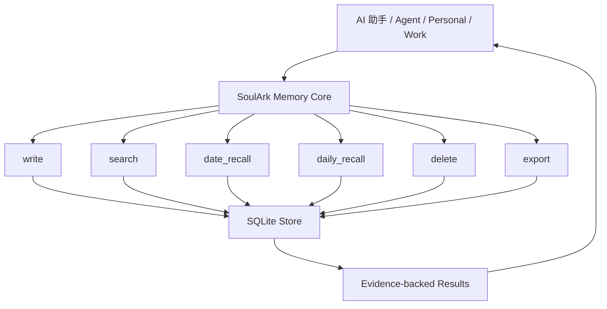
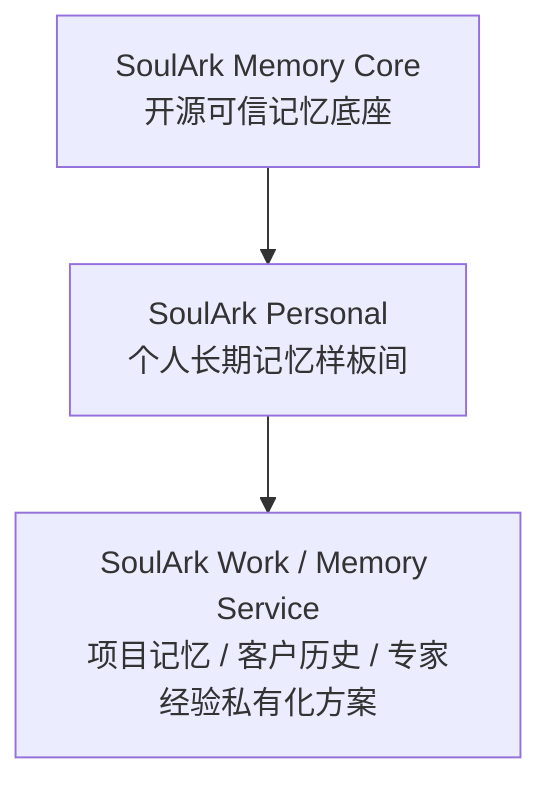

# SoulArk Memory Core

> 开源 AI 长期记忆可信底座：让 AI 记住用户、项目和决策，而且每条记忆都有证据、可删除、可导出。

[English](README.en.md)

SoulArk Memory Core 不是另一个聊天机器人，也不是普通向量库包装。它是给 Personal、Work、Agent 产品使用的长期记忆 Core：负责把记忆写下来，按关键词 / 文本或日期召回，带证据返回，并支持删除和导出。

它适合用来构建：

- 个人 AI 助手的长期记忆
- 项目记忆助手
- 客户历史助手
- 专家经验助手
- 数字分身 / 第二大脑产品
- 需要私有部署、证据追溯、删除和导出的 Agent 应用

## 解决什么问题

很多 AI 助手每次对话都像重新认识你：换模型、换应用、换会话后，过去的上下文就断了。

SoulArk Memory Core 提供一个独立、可自托管、跨模型的长期记忆 API，让上层 Agent 可以稳定地写入、搜索、按日期召回、删除和导出记忆，而不是把记忆绑定在某个模型厂商、某个聊天窗口或某个应用里。

它不承诺“永远正确”或“永久不变”。长期记忆会过期、会被纠正，也可能需要重新确认。所以 v0.1 更强调：

- evidence：每条召回都有证据
- traceability：能追溯来源
- delete：能删除
- export：能导出
- self-hosted：能自己部署

## 技术结构



## 产品分层



Memory Core 只做底层长期记忆能力。Personal、Work、PolicyGuard、Ambient、Surprise、Project State 这些属于上层产品体验，不放进 Core v0.1。

## 当前范围

v0.1 范围刻意保持很窄：

- `write`
- `search`
- `date_recall`
- `daily_recall`
- `delete`
- `export`
- SQLite 存储
- HTTP API
- Docker
- 最小 Flask Web / Demo 页面
- evidence 返回

## 契约文档

当前先固定 v0.1 的小闭环，不往 Core 里塞体验层能力：

- [Scope / 边界](docs/scope.md)
- [API Contract / HTTP 契约](docs/api_contract.md)
- [Evidence Contract / 证据契约](docs/evidence_contract.md)

v0.1 不包含：

- 人设 prompt
- Stable Profile
- PolicyGuard
- Project State
- Ambient / Surprise
- 复杂业务编排
- 飞书 / Web / 桌面端等连接器
- 企业权限系统

## 和普通知识库有什么区别

普通知识库更像“查资料”，SoulArk Memory Core 更像“记住发生过什么”。

它关注的不只是文本匹配，还包括：

- 这条记忆属于谁
- 发生在什么时候
- 来源是什么
- 为什么能这么回答
- 能不能删除
- 能不能导出
- 是否为后续纠错、替换和过期标记保留扩展空间

## 快速开始

Docker Compose：

```bash
docker compose up -d --build
curl http://127.0.0.1:8765/health
```

本地 Python：

```bash
pip install -r requirements.txt
python run.py
```

默认服务地址：`http://127.0.0.1:8765`

## API 示例

写入一条记忆：

```bash
curl -X POST http://127.0.0.1:8765/api/v1/write \
  -H "Content-Type: application/json" \
  -d '{
    "items": [
      {
        "user_id": "demo_user",
        "memory_space": "personal",
        "source_id": "demo-001",
        "content": "I tested SoulArk Memory Core today.",
        "event_type": "raw_message",
        "sender": "user",
        "role": "assistant",
        "occurred_at": "2026-05-14T10:00:00+00:00"
      }
    ]
  }'
```

搜索记忆：

```bash
curl -X POST http://127.0.0.1:8765/api/v1/search \
  -H "Content-Type: application/json" \
  -d '{"user_id":"demo_user","memory_space":"personal","query":"Memory Core","limit":5}'
```

按日期召回：

```bash
curl -X POST http://127.0.0.1:8765/api/v1/date-recall \
  -H "Content-Type: application/json" \
  -d '{"user_id":"demo_user","memory_space":"personal","date":"2026-05-14","timezone":"UTC","limit":10}'
```

按天汇总召回：

```bash
curl -X POST http://127.0.0.1:8765/api/v1/daily-recall \
  -H "Content-Type: application/json" \
  -d '{"user_id":"demo_user","memory_space":"personal","date":"2026-05-14","timezone":"UTC","limit":10}'
```

导出：

```bash
curl "http://127.0.0.1:8765/api/v1/export?user_id=demo_user&memory_space=personal&limit=10"
```

删除：

```bash
curl -X POST http://127.0.0.1:8765/api/v1/delete \
  -H "Content-Type: application/json" \
  -d '{"user_id":"demo_user","memory_space":"personal","ids":["<memory_id_from_write_response>"]}'
```

## Personal 集成示例

启动本地服务后，可以运行一个最小的 `Personal -> Core` HTTP 示例：

```bash
python examples/personal_core_integration_sample.py
```

这个示例会通过 HTTP 写入一条记忆，然后验证 `search`、`daily_recall` 和 `export`。

## API

- `GET /health`
- `GET /`
- `GET /demo`
- `POST /api/v1/write`
- `POST /api/v1/search`
- `POST /api/v1/date-recall`
- `POST /api/v1/daily-recall`
- `POST /api/v1/delete`
- `GET /api/v1/export`

## Docker 验收

```bash
docker compose up -d --build
bash scripts/verify_http_acceptance.sh http://127.0.0.1:8765
```

HTTP 验收脚本会验证完整 v0.1 闭环：

```text
health -> write -> search -> daily_recall -> export -> delete
```

Windows PowerShell 一键 Docker 验收：

```powershell
./scripts/verify_docker_acceptance.ps1
```

## 发布前检查

对外分享或部署前，至少确认：

- 仓库里的 `data/` 只保留 `.gitkeep`。
- `.env`、API key、日志、SQLite 运行时文件没有进入仓库。
- Linux 上 `bash scripts/verify_http_acceptance.sh http://127.0.0.1:8765` 能通过。
- Windows Docker 环境下 `./scripts/verify_docker_acceptance.ps1` 能通过。
- 如果要暴露给外部访问，必须放在你自己的鉴权网关后面。

## 安全说明

- 不要在没有鉴权、授权和限流的情况下把服务直接暴露到公网。
- 处理真实客户或公司记忆前，需要补 TLS、访问日志、备份策略和审计能力。
- 不要提交真实记忆数据库、`.env`、API key、日志或个人数据。
- 仓库只保留 `data/.gitkeep`；运行时生成的 SQLite 文件已被 `.gitignore` 忽略。
- 记忆导出应视为敏感用户数据处理。

## 路线图

- v0.1：write / keyword search / date_recall / daily_recall / delete / export / evidence / Docker
- v0.2：Memory Card、FTS5、更清晰的 Web 查看
- v0.3：MCP / Project Brief
- v0.4：stale memory、needs_review、superseded

## 联系 / 交流

如果你对长期记忆 AI 助手、私有化部署、项目记忆 / 客户历史助手感兴趣，可以扫码联系我。

添加请备注：SoulArk


## License

MIT License. See [LICENSE](LICENSE).
