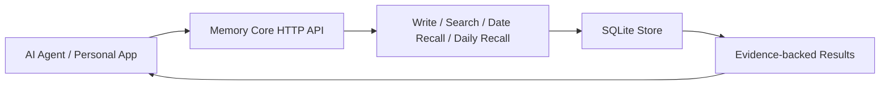

# SoulArk Memory Core

> 开源 AI Agent 长期记忆核心：让 AI 不再每次从零认识你。

[English](README.md)

SoulArk Memory Core 是一个可自托管、可追溯、可删除、可导出的长期记忆底座，面向 AI Agent、个人 AI 助手和数字分身场景。

它不是一个“记忆保险箱”，也不是普通向量库包装。它更接近一套给 AI Agent 使用的长期记忆 API：负责把记忆写下来、按语义或日期召回、带证据返回、支持删除和导出。

## 为什么需要它？

很多 AI 助手每次对话都像重新认识你：换模型、换应用、换会话后，过去的上下文就断了。

SoulArk Memory Core 的目标是提供一个独立的记忆底座，让上层 Agent 可以通过稳定 API 使用长期记忆，而不是把记忆绑定在某个模型厂商、某个聊天窗口或某个应用里。

适合的方向：

- AI Agent 长期记忆核心
- 可自托管的个人 AI 记忆底座
- 跨模型、跨应用的记忆 API
- 面向数字分身 / 第二大脑产品
- 需要证据追溯、删除、导出的 Agent 应用

它不承诺“永远正确”或“永久不变”。长期记忆会过期、会被纠正，也可能需要重新确认。所以 v0.1 更强调 evidence、traceability、delete、export，而不是黑盒式“我记得”。

## 架构



## 当前范围

v0.1 范围刻意保持很窄：

- `write`
- `search`
- `date_recall`
- `daily_recall`
- `delete`
- `export`
- SQLite 存储
- 最小 Flask Web / Demo 页面

v0.1 不包含：

- 人设 prompt
- Stable Profile
- PolicyGuard
- Project State
- Ambient / Surprise
- 复杂业务编排
- 飞书 / Web / 桌面端等连接器

这些属于上层 Agent / 产品体验层，不属于 Memory Core 底座。

## 快速开始

```bash
pip install -r requirements.txt
python run.py
```

默认服务地址：`http://127.0.0.1:8765`

## API 示例

写入一条记忆：

```bash
curl -X POST http://127.0.0.1:8765/api/v1/write \
  -H "Content-Type: application/json" \
  -d '{
    "items": [
      {
        "user_id": "demo_user",
        "memory_space": "personal",
        "source_id": "demo-001",
        "content": "I tested SoulArk Memory Core today.",
        "event_type": "raw_message",
        "sender": "user",
        "role": "assistant",
        "occurred_at": "2026-05-14T10:00:00+00:00"
      }
    ]
  }'
```

搜索记忆：

```bash
curl -X POST http://127.0.0.1:8765/api/v1/search \
  -H "Content-Type: application/json" \
  -d '{"user_id":"demo_user","memory_space":"personal","query":"Memory Core","limit":5}'
```

导出和删除：

```bash
curl "http://127.0.0.1:8765/api/v1/export?user_id=demo_user&memory_space=personal&limit=10"

curl -X POST http://127.0.0.1:8765/api/v1/delete \
  -H "Content-Type: application/json" \
  -d '{"user_id":"demo_user","memory_space":"personal","source_id":"demo-001"}'
```

## Personal 集成示例

启动本地服务后，可以运行一个最小的 `Personal -> Core` HTTP 示例：

```bash
python examples/personal_core_integration_sample.py
```

这个示例会通过 HTTP 写入一条记忆，然后验证 `search`、`daily_recall` 和 `export`。

## API

- `GET /health`
- `GET /`
- `GET /demo`
- `POST /api/v1/write`
- `POST /api/v1/search`
- `POST /api/v1/date-recall`
- `POST /api/v1/daily-recall`
- `POST /api/v1/delete`
- `GET /api/v1/export`

## Docker

```bash
docker build -t soulark-memory-core .
docker run --rm -p 8765:8765 -v memory-core-data:/data soulark-memory-core
```

Docker 环境下数据库默认在 `/data/memory_core.db`，本地运行时默认在 `data/memory_core.db`。

Linux 临时测试环境：

```bash
docker compose up -d --build
bash scripts/verify_http_acceptance.sh http://127.0.0.1:8765
```

`docker-compose.yml` 会把 SQLite 数据持久化到 `./data`。

如果你更习惯 `systemd`：

```bash
bash deploy/ubuntu/bootstrap.sh
cp deploy/ubuntu/env.example deploy/ubuntu/.env
sudo cp deploy/ubuntu/soulark-memory-core.service /etc/systemd/system/
sudo systemctl daemon-reload
sudo systemctl enable --now soulark-memory-core@$(whoami)
```

这个部署方式适合临时验证。直接暴露到公网前，请自行增加访问控制层。

Windows PowerShell 一键 Docker 验收：

```powershell
./scripts/verify_docker_acceptance.ps1
```

## 安全说明

- 不要在没有鉴权、授权和限流的情况下把服务直接暴露到公网。
- 不要提交真实记忆数据库、`.env`、API key、日志或个人数据。
- 仓库只保留 `data/.gitkeep`；运行时生成的 SQLite 文件已被 `.gitignore` 忽略。
- 记忆导出应视为敏感用户数据处理。

## License

MIT License. See [LICENSE](LICENSE).
